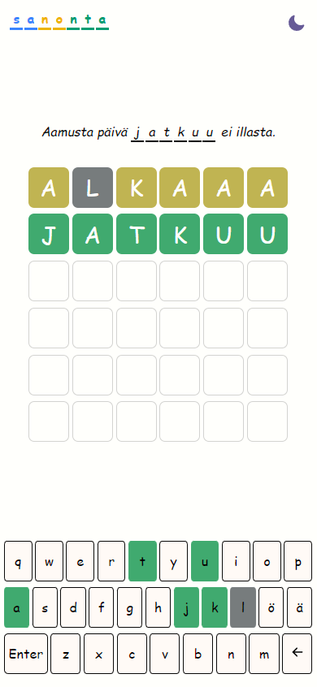

# proverble

Wordle clone where you guess a word from a proverb, the proverb changes daily.

### Frontend
- Typescript
- React
- Styled Components

### Backend
- Spring boot
- MySQL database

### How to run?
#### Database
Install Docker, Docker Compose
cd to `proverble/spring-backend/sanonta-backend/docker`
run `docker-compose up`

#### Backend
I'm using Java 17 and openJDK.
cd to `proverble/springboot-backend/sanonta-backend`  
run `mvn spring-boot:run`

### Frontend
I'm using node version 18
cd to `proverble/frontend`
run `npm install && npm run dev`

To run the production build of the app:
`npm run buld`
`npm run preview`
